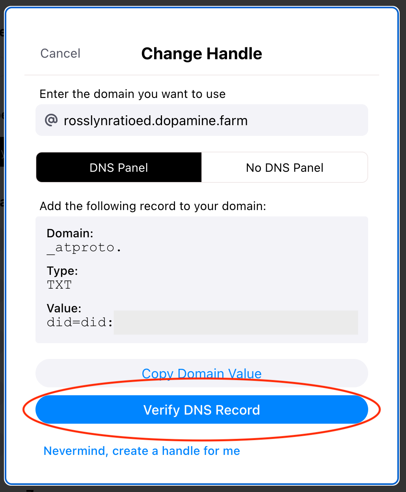

# Bluesky Custom Domain Handles Guide

## Table of Contents

- [Background](#background)
- [Requirements](#requirements)
- [Instructions](#instructions)
  - [Get Started With GitHub Pages](#get-started-with-github-pages)
    - [Create a New Repo](#create-a-new-repo)
    - [Enable GitHub Pages](#enable-github-pages)
    - [Create a Homepage](#create-a-homepage)
    - [Disable Jekyll](#disable-jekyll)
  - [Obtain Your AT Protocol DID](#obtain-your-at-protocol-did)
    - [For Domains](#for-domains)
    - [For Subdomains](#for-subdomains)
  - [DNS Configuration](#dns-configuration)
    - [For Domains and Subdomains](#for-domains-and-subdomains)
    - [For Subdomains](#for-subdomains-1)
    - [For GitHub Pages](#for-github-pages)
  - [Talk With the AT Protocol Domain Handle Service](#talk-with-the-at-protocol-domain-handle-service)
    - [For Domains](#for-domains-1)
    - [For Subdomains](#for-subdomains-2)
  - [Change Your Bluesky Handle to Your Domain](#change-your-bluesky-handle-to-your-domain)
    - [For domains](#for-domains-2)
    - [For Subdomains](#for-subdomains-3)

## Background

The Bluesky docs<sup>1</sup> were a little unclear to me, so I figured out what I consider to be the easiest way to set up a domain or subdomain handle with the AT Protocol. This method is free and requires minimal technical knowledge.

## Requirements

- A [GitHub](https://github.com/) account
- A [basic working knowledge of Git](https://docs.github.com/en/get-started/quickstart/hello-world).
  - Don't worry if you’re not experienced with the terminal – try using a [desktop git client](https://desktop.github.com/) if you need a visual interface!
- A domain and/or subdomain that you own and the ability to manage DNS records for it.
  - Common domain registrars include [porkbun](https://porkbun.com/), [namecheap](https://www.namecheap.com/), and [GoDaddy](https://www.godaddy.com/).

## Instructions

### Get Started With GitHub Pages

[GitHub Pages](https://pages.github.com/) lets you host static content directly from a GitHub repository. It's free, easy to use, and has the benefit of way less overhead for those of us who can't or don't want to maintain a website and hosting infrastructure.

ⓘ For a gentle introduction to GitHub Pages, you might want to try the [Hello World tutorial](https://docs.github.com/en/get-started/quickstart/hello-world).

#### Create a New Repo

[Create a new repository](https://github.com/new) and name it `YOUR_GITHUB_HANDLE.github.io`, replacing the placeholder with your username. Your GitHub username does not need to match your Bluesky handle, but your GitHub site name does need to include your GitHub handle.

#### Enable GitHub Pages

1. From your repo, you can then go into `Settings > Pages` and enable GitHub Pages.

2. On the same page under the `Build and deployment` section, click the `Source` dropdown and select `Deploy from a branch`.

3. Last but not least, check the `Branch` section to make sure you are serving your site from the `/ (root)` folder in the `main` branch.

<center>
<h5>It should look like this:</h5>

</center>

<br />

#### Create a Homepage

Create a homepage for your site by adding an `index.html` file. Mine is currently just a blank HTML page that redirects to my Bluesky profile. You can copy the following HTML and insert your domain or subdomain into the `URL` attribute of the bottom-most `<meta>` tag:

```html
<!DOCTYPE html>
<html lang="en">
  <head>
    <meta charset="UTF-8" />
    <meta name="viewport" content="width=device-width, initial-scale=1.0" />
    <title>Redirecting You To My Cool Bluesky Profile 😎</title>
    <meta http-equiv="refresh" content="0; URL=https://bsky.app/profile/YOUR_DOMAIN_OR_SUBDOMAIN" />
  </head>
  <body></body>
</html>
```

#### Disable Jekyll

GitHub Pages uses Jekyll as the default backend. This causes problems for us. We need to be able to serve a raw text file, but having Jekyll enabled will return `404 Not Found` at the path of our file. To fix this, simply add a `.nojekyll` file to your repository.

### Obtain Your AT Protocol DID

To get ready for the following sections, you'll need your Decentralied Identifier (DID).<sup>2</sup> This is a globally unique identifier attached your profile that is used to communicate with the AT Protocol.

#### For domains

Head over to Bluesky and navigate to `Settings > Change handle`. Click `I have my own domain`. With the `DNS Panel` tab selected, click the `Copy Domain Value` button located at the bottom and paste it somewhere else for safekeeping.

#### For subdomains

Follow the same steps outlined above, but select the `No DNS Panel` tab instead. Click the `Copy File Contents` button at the bottom and paste it somewhere else for safekeeping.

ⓘ Don't worry about uploading any files yet – we'll take care of that in one of the later sections.

### DNS Configuration

ⓘ This guide assumes that your domain came with properly configured `A` and `NS` records.

The steps below will help you connect your domain to your newly created GitHub Pages site.<sup>3</sup>

#### For Domains and Subdomains

Go to your domain registrar's DNS management console, add the following 4 records to your domain:

| Type | Name | Value           |
| ---- | ---- | --------------- |
| A    | @    | 185.199.108.153 |
| A    | @    | 185.199.109.153 |
| A    | @    | 185.199.110.153 |
| A    | @    | 185.199.111.153 |

ⓘ Keep in mind that in some cases, the propagation of new DNS records can take up to 24 hours.

#### For Subdomains

In your domain registrar's DNS management console, add the following record to your domain:

| Type  | Name             | Value                          |
| ----- | ---------------- | ------------------------------ |
| CNAME | `YOUR_SUBDOMAIN` | `YOUR_GITHUB_HANDLE.github.io` |

##### Example

I have the domain `dopamine.farm` and I want to create the subdomain `rosslynratioed.dopamine.farm`. To do this, I add the following DNS record to my domain:

| Type  | Name             | Value                      |
| ----- | ---------------- | -------------------------- |
| CNAME | `rosslynratioed` | `rosslynratioed.github.io` |

#### For GitHub Pages

To finish connecting our domain to our GitHub Pages site, go back to your repository and into `Settings > Pages`. Enter your domain or subdomain into the `Custom domain` field. This will automatically commit a `CNAME` record to your repo pointing to your custom domain.

ⓘ GitHub will perform a DNS check and let you know whether or not your domain resolution was successful.

<center>

</center>

### Talk With the AT Protocol Domain Handle Service

#### For Domains

In your registrar's DNS management console for your domain, add the following record:

| Type | Domain     | Value                                            |
| ---- | ---------- | ------------------------------------------------ |
| TXT  | `_atproto` | [YOUR_ATPROTO_DID](#obtain-your-at-protocol-did) |

#### For Subdomains

- In your repo, create a folder called `.well-known`.
- Inside `.well-known` create a file called `atproto-did`. The contents of this file should be the DID that you obtained by following the instructions in [this section](#obtain-your-at-protocol-did)

### Change Your Bluesky Handle to Your Domain

#### For Domains and Subdomains

Return to Bluesky and navigate to `Settings > Change handle` and click `I have my own domain`.

Enter your desired handle (your domain) in the text field at the top.


**If you're configuring a domain,** Select the `DNS Panel` tab

**If you're configuring a subdomain,** Select the `No DNS Panel` tab

Finally, click `Verify DNS Record` at the bottom of the modal, or the `Verify Text File` button if configuring a subdomain.

<br />

<center>
  
</center>

<br />

If all goes well, you should get a feedback message alerting you that your domain was verified!

<br />

<center>
  
</center>

<br />


From there, just click the button that says `Update to YOUR_DOMAIN_OR_SUBDOMAIN`. 

Congrats - your domain name is now your very own custom Bluesky handle! 😊

For reference, the GitHub repository you created should at this point mirror the structure of [this example](https://github.com/rosslynratioed/bsky-domain-handles-guide/tree/main/example).

## Security Considerations

TODO

## Footnotes

1. You can read the official Bluesky tutorial posted to their blog [here](https://blueskyweb.xyz/blog/4-28-2023-domain-handle-tutorial)
2. For a deeper dive into DIDs, you can read the docs [here](https://atproto.com/specs/did)
3. These instructions are a simplified version of [this section](https://docs.github.com/en/pages/configuring-a-custom-domain-for-your-github-pages-site/managing-a-custom-domain-for-your-github-pages-site#configuring-an-apex-domain) of the GitHub Pages documentation.
4. These instructions are also a simplified version of [this section](https://docs.github.com/en/pages/configuring-a-custom-domain-for-your-github-pages-site/about-custom-domains-and-github-pages#using-a-subdomain-for-your-github-pages-site) of the GitHub Pages documentation

## Contributing

If it feels like something is missing or could be improved, feel free to [file an issue](https://github.com/rosslynratioed/bsky-domain-handles-guide/issues) or [create a pull request](https://github.com/rosslynratioed/bsky-domain-handles-guide/pulls)!
